<h1 align="center"><b>SIMBOLOGIES FOR QGIS</b></h1>
<p align="center">
<a href="https://github.com/qgispe"></a> <a href="#"></a> <a href="#"></a> <a href="https://t.me/qgisperu"></a>
</p>

This repository has a set of simbologies for different thematics such as disaster, environment, covid-19, archeological, etc.
All the icons has reference and the name of its authors.
The main goals of this repository is have a place where someone can find easily some source for the creation of its themathic map in **QGIS**.

---
## **CATEGORIES**

<table align="center">
 <tr>
  <th><p align="center">Agriculture</p></th>
  <th><p align="center">Ecology</p></th>
  <th><p align="center">Food</p></th>
 </tr>
 <tr>
  <td align="center">
   <a href="">
    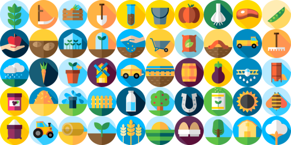
     <br/>
     <sub>
     <b>Download</b>
     </sub>
    </a>
   </td>
  <td align="center">
   <a href="">
    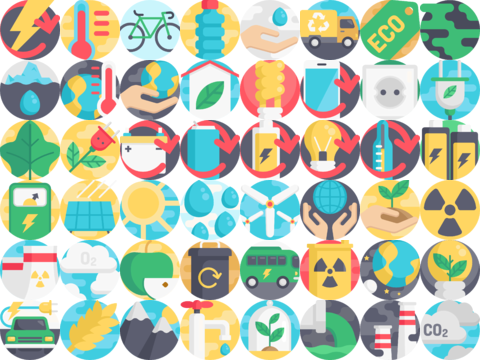
     <br/>
     <sub>
     <b>Download</b>
     </sub>
    </a>
  </td>
    <td align="center">
   <a href="">
    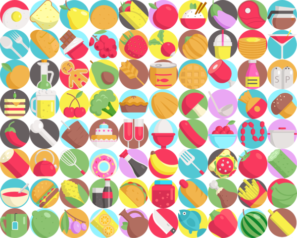
     <br/>
     <sub>
     <b>Download</b>
     </sub>
    </a>
  </td>
  <tr>
  <th><p align="center">Arial animals</p></th>
  <th><p align="center">Acuatic animals</p></th>
  <th><p align="center">Terrestrial animals</p></th>
  </tr>
 <td align="center">
   <a href="">
    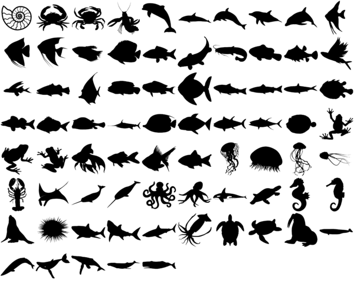
     <br/>
     <sub>
     <b>Download</b>
     </sub>
    </a>
   </td>
  <td align="center">
   <a href="">
    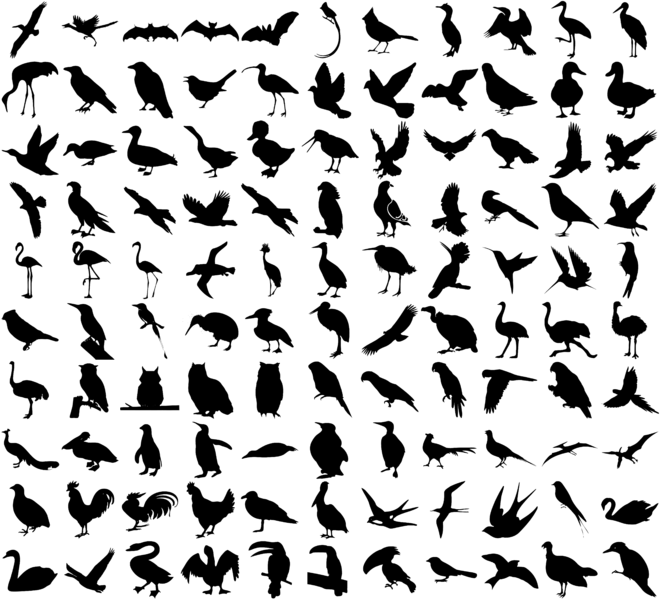
     <br/>
     <sub>
     <b>Download</b>
     </sub>
    </a>
  </td>
  <td align="center">
   <a href="">
    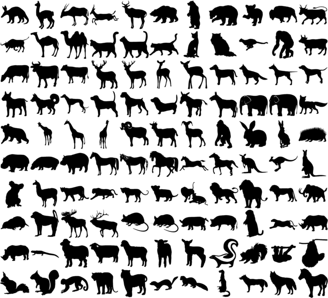
     <br/>
     <sub>
     <b>Download</b>
     </sub>
    </a>
  </td>
 <tr>
  <th><p align="center">Disaster</p></th>
  <th><p align="center">Drones</p></th>
  <th><p align="center">Pandemic</p></th>
  </tr>
 <td align="center">
   <a href="">
    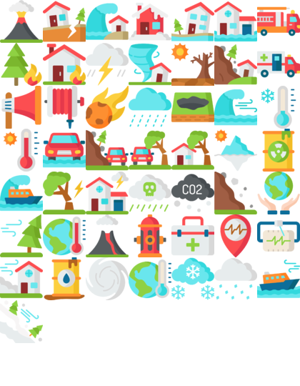
     <br/>
     <sub>
     <b>Download</b>
     </sub>
    </a>
   </td>
  <td align="center">
   <a href="">
    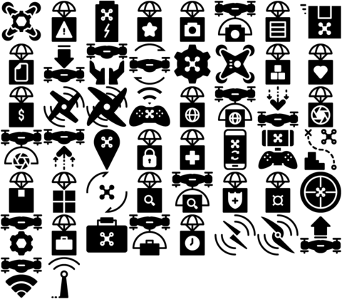
     <br/>
     <sub>
     <b>Download</b>
     </sub>
    </a>
  </td>
  <td align="center">
   <a href="">
    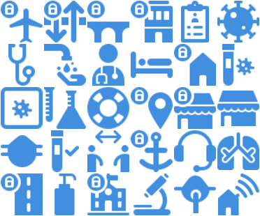
     <br/>
     <sub>
     <b>Download</b>
     </sub>
    </a>
  </td>
   <tr>
  <th><p align="center">Archeological - I</p></th>
  <th><p align="center">Archeological - II</p></th>
  <th><p align="center">North</p></th>
  </tr>
 <td align="center">
   <a href="">
    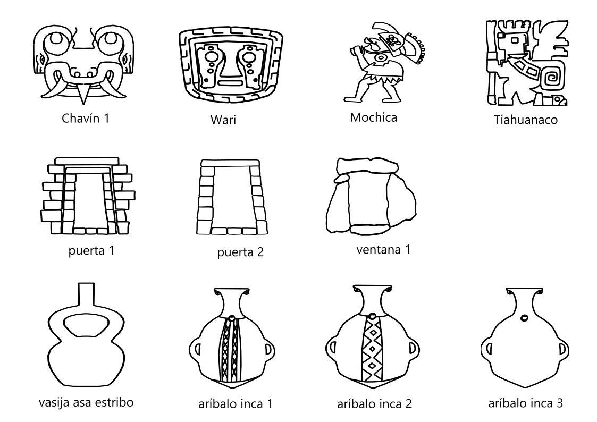
     <br/>
     <sub>
     <b>Download</b>
     </sub>
    </a>
   </td>
  <td align="center">
   <a href="">
    
     <br/>
     <sub>
     <b>Download</b>
     </sub>
    </a>
  </td>
  <td align="center">
   <a href="">
    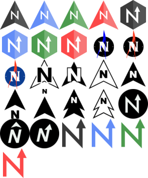
     <br/>
     <sub>
     <b>Download</b>
     </sub>
    </a>
  </td>
  <tr>
   <th><p align="center">Wheather</p></th>
   <th><p align="center">Multiple icons</p></th>
   <th><p align="center">Geology</p></th>
  </tr>
  <td align="center">
   <a href="">
    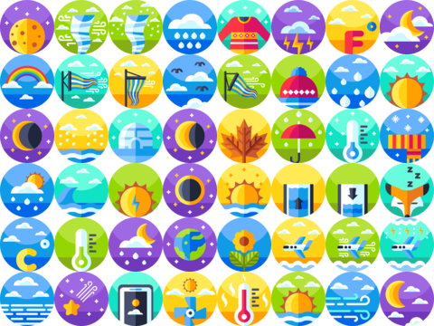
     <br/>
     <sub>
     <b>Download</b>
     </sub>
    </a>
   </td>

   <td align="center">
   <a href="">
    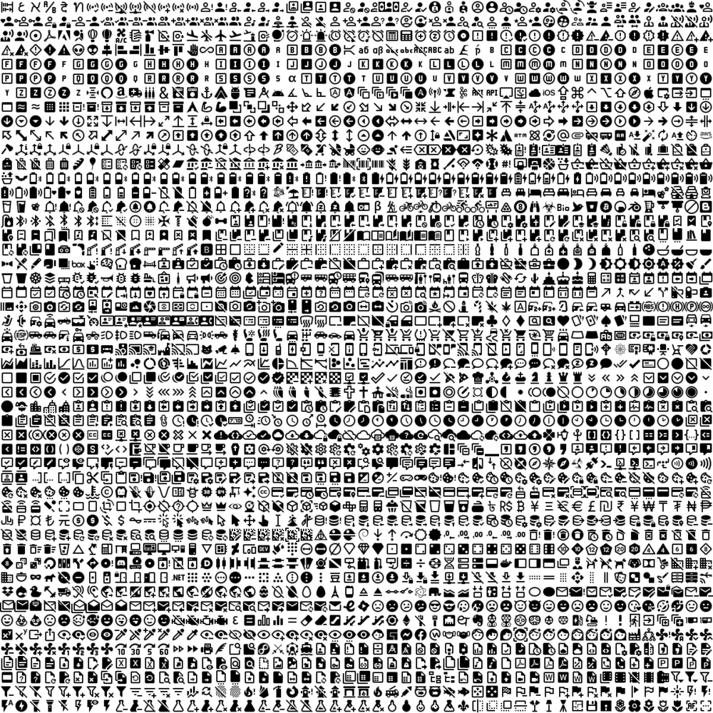
     <br/>
     <sub>
     <b>Download</b>
     </sub>
    </a>
   </td>

   <td align="center">
   <a href="">
    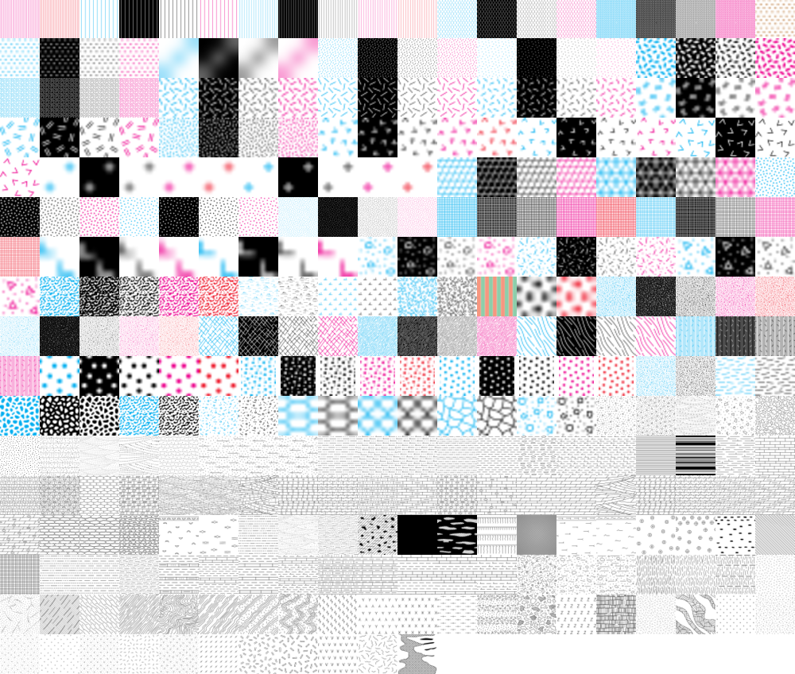
     <br/>
     <sub>
     <b>Download</b>
     </sub>
    </a>
   </td>


 </tr>
</table>

---
## **TEAM**

<table>
  <tr>
    <td align="center"><a href="https://github.com/ambarja"><br /><sub><b>Antony Barja</b></sub></a></td>
    <td align="center"><a href="https://github.com/bzdjahna"><br /><sub><b>Diana Morvejo</b></sub></a></td>
</table>

---

## **SHARE AND CONTRIBUTE**
If you want contribute with this repository and put your own simbologies, just should following the next steps:

1. Fork the repository
2. To create a new file directory and put your own simbologies with a file rar o tar.
3. Add new collage of the simbologies, if you uses magick you can use the next code
     ```
     montage *.svg -geometry 60x60+0+0 -tile nxm collage_divers.png
     ```
4. Finally you only to do a pull request.